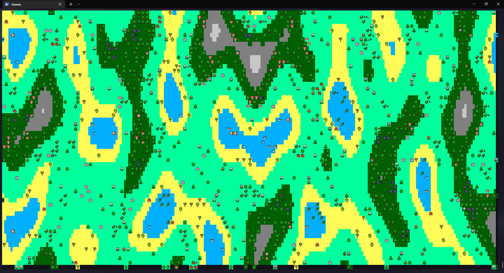

# EcoSphere



## A Complete Ecosystem Simulation in the Terminal

EcoSphere is an immersive terminal-based ecosystem simulation crafted with Python and the curses library. Experience the intricate dynamics of a procedurally generated ecosystem, where various entities interact within diverse biomes.

Watch EcoSphere come to life on [YouTube](https://www.youtube.com/watch?v=LY2vksgqkPE)!

### Features
- **Diverse Entities:** Includes Plants, Animals, Food, and Food Spawners.
- **Procedural Generation:** Entities are dynamically generated with random parameters across different biomes, including water, desert, plains, forest, and mountains.
- **Intelligent Behavior:** Entities make decisions based on their needs and surrounding environment.
- **Life Cycle:** Entities can reproduce, search for food, eat, seek water, move across the terrain, and ultimately, face death.
- **Interactive Statistics:** Use the -s flag to display statistics about entities when you hover over them.
- **Debug Mode:** Activate debug mode with the -d flag to gain insights into the simulation's mechanics.

### Controls
- Press `q` to quit

### Installation
1. Clone the repository and navigate to the directory in terminal
```bash
git clone https://github.com/style77/ecosphere.git
cd ecosphere
```
2. Install dependencies
```bash
pip3 install -r requirements.txt
```
3. Run the simulation
```bash
python3 ecosphere.py
```

### License
This project is licensed under the MIT License - see the [LICENSE](LICENSE) file for details

### Contributing
Contributions are warmly welcomed! Whether it's bug reports, feature suggestions, or direct code contributions, all forms of help are appreciated to further improve EcoSphere.

### Acknowledgments
- [curses](https://docs.python.org/3/library/curses.html) library
- [windows-curses](https://pypi.org/project/windows-curses/) library